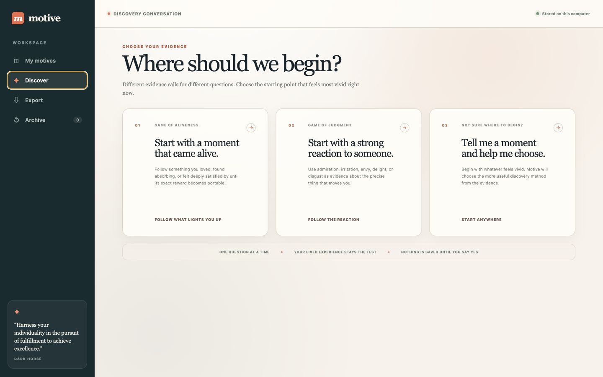
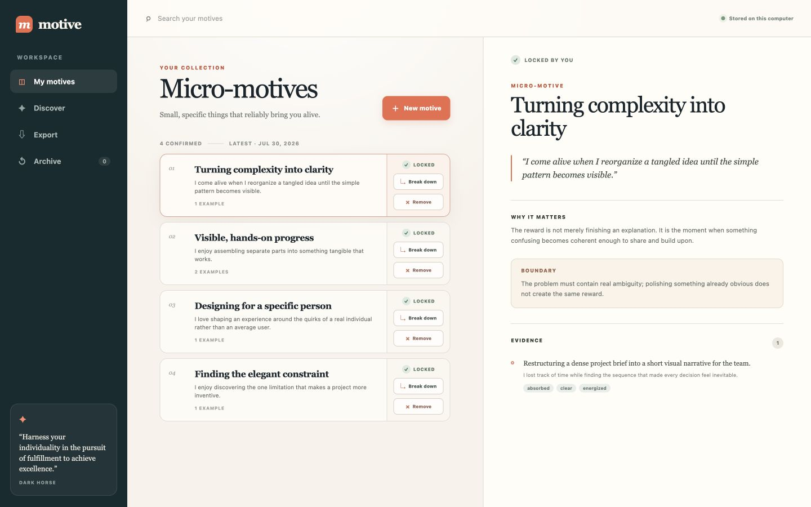
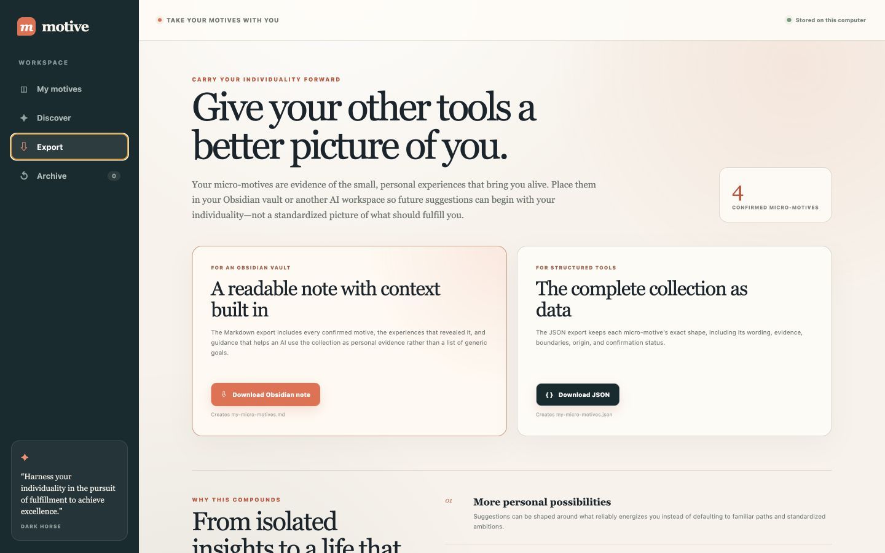

# Micro-Motive Games

*Discover the small, specific things that make you come alive.*

Micro-Motive Games is a local-first workspace inspired by Todd Rose and
Ogi Ogas's *[Dark Horse](https://www.toddrose.com/darkhorse)*.

Use it to:

- discover micro-motives through guided, one-question-at-a-time conversations;
- save a motive only when you confirm it with `YES`;
- break broad motives into more specific ones;
- export your collection to Obsidian or another AI system.

The model makes predictions. You decide what is true.

## How it works

### 1. Find micro-motives with Discover

Begin with a moment that came alive, a strong reaction to someone, or whatever
experience feels most vivid. The guided conversation asks one question at a
time until it can predict a specific micro-motive for you to judge.



### 2. Collect, sharpen, and lock them in

Nothing joins your collection until you confirm it. Each locked micro-motive
keeps the experience that revealed it, and broad motives can be broken into
smaller predictions for you to test individually.



### 3. Carry your individuality into your other AI tools

Export your collection as an Obsidian-ready note or structured JSON. Add it to
the context used by your personal AI so its suggestions can reflect what
actually brings you alive—whether you are choosing work, planning a schedule,
developing content, or deciding what to make next.



## Start with Codex

You need the [Codex app](https://openai.com/codex/) and a ChatGPT account with
access to Codex. Open a new Codex task and paste:

```text
Set up Micro-Motive Games for me from
https://github.com/siroccomask/micro-motive-games.

Clone the repository into a new local folder, read its setup instructions,
install what it needs, check that my Codex login is ready, start the app, and
open it for me. If you need me to complete a sign-in step, tell me exactly what
to do.
```

Codex will prepare the project and open the local workspace. Once it is running,
choose **Discover** and begin with whichever kind of real experience feels most
vivid.

No OpenAI API key is required. The app sends discovery prompts through your
ChatGPT-authenticated Codex session and saves confirmed motives on your
computer in `data/micro-motives.json`.

<details>
<summary>Prefer to set it up in a terminal?</summary>

You need [Node.js 20+](https://nodejs.org/).

```bash
git clone https://github.com/siroccomask/micro-motive-games.git
cd micro-motive-games
npm install
npm run codex:login
npm run dev
```

Then open [http://127.0.0.1:3000](http://127.0.0.1:3000).

</details>

## Discovery methods

The **Discover** page lets you deliberately begin with:

- [Game of Aliveness](game-of-aliveness/) — follow a real moment you loved
  toward its exact rewarding feature;
- [Game of Judgment](game-of-judgment/) — trace a strong reaction to someone
  through the behavior, feeling, and precise trigger; or
- an adaptive start that chooses between those methods from your first story.

Each method runs as its own typed BAML process through your Codex subscription.
The included [micro-motive simulation](micro-motive-sim/) remains a standalone
Codex skill for exploring possibilities after you have confirmed motives.

Game of Aliveness is this project's name for a positive-memory companion to
the book's advice to examine what you love. Game of Judgment comes directly
from *Dark Horse*.

## Your data

Raw discovery chats are sent through Codex but are not saved by this app. Only
confirmed micro-motives and their short evidence summaries are written to the
local data file. Use **Export** in the left navigation to download an
Obsidian-ready Markdown note or structured JSON.

This independent project is inspired by *Dark Horse*. It is not affiliated
with or endorsed by the book's authors.
